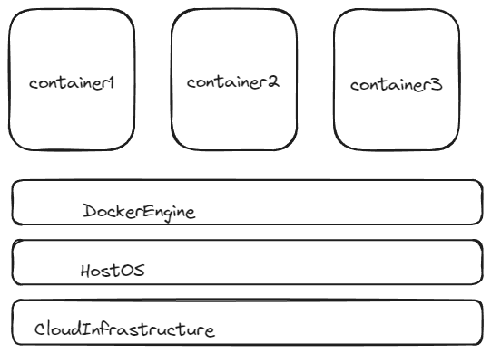
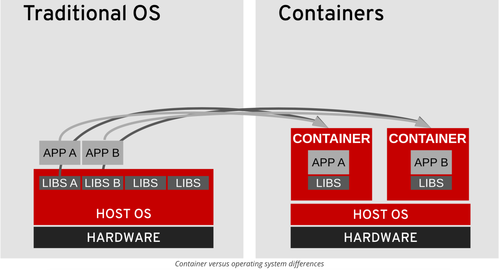
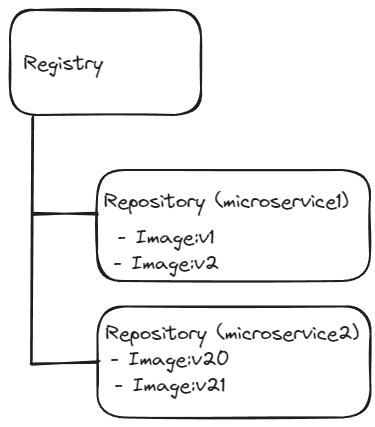
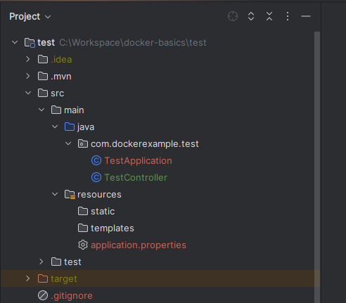
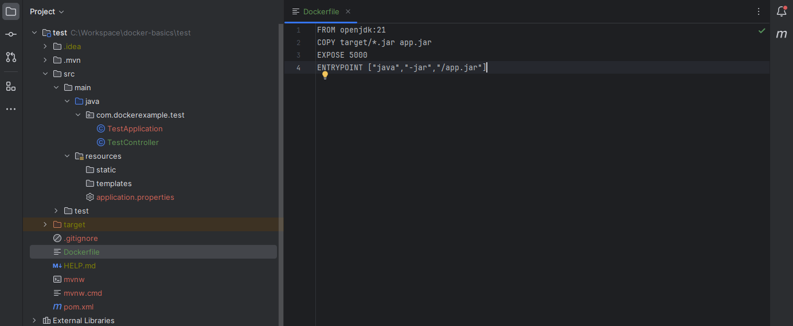
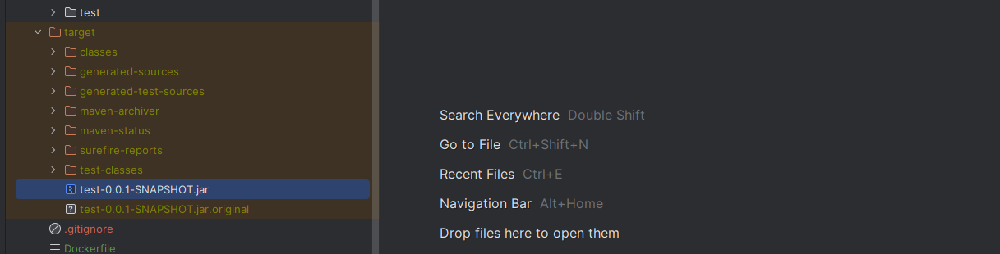
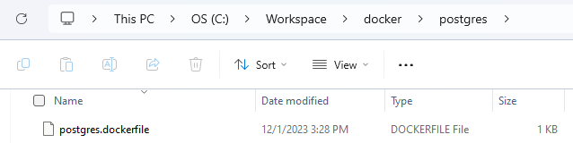
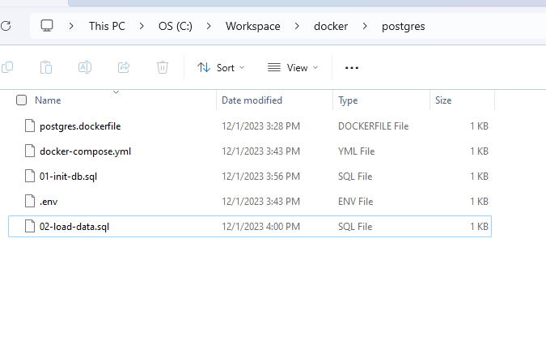
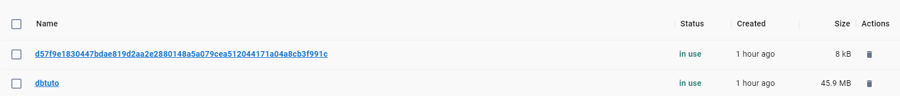

<h1 align="center"> Docker </h1>

# Content

1. [Chapter 1: Introducing to Docker](#chapter1)
    - [Chapter 1 - Part 1: How does Traditional Deployment Work?](#chapter1part1)
    - [Chapter 1 - Part 2: Understanding Deployment Process with Docker](#chapter1part2)
	- [Chapter 1 - Part 3: How does Docker Make it Easy?](#chapter1part3)
	- [Chapter 1 - Part 4: Why is Docker Popular?](#chapter1part4)
	- [Chapter 1 - Part 5: Understanding How Docker Works](#chapter1part5)
	- [Chapter 1 - Part 6: What's happening in the Background?](#chapter1part6)
	- [Chapter 1 - Part 7: Understanding Docker Terminology](#chapter1part7)
	- [Chapter 1 - Part 8: Essential Docker Commands List](#chapter1part8)
2. [Chapter 2: Work with Docker](#chapter2)
    - [Chapter 2 - Part 1: Creating Docker Image of a Spring Boot Application](#chapter2part1)
	- [Chapter 2 - Part 2: Creating Docker Image Using Multi Stage Dockerfile](#chapter2part2)
	- [Chapter 2 - Part 3: Optimizing Dockerfile](#chapter2part3)
	- [Chapter 2 - Part 4: Creating Docker Image with Spring Boot Maven Plugin](#chapter2part4)
	- [Chapter 2 - Part 5: Creating Postgres Docker Container](#chapter2part5)

## <a name="chapter1"></a>Chapter 1: Introducing to Docker

#### <a name="chapter1part1"></a>Chapter 1 - Part 1: How does Traditional Deployment Work?

- Deployment process described in a document

- Operations team follows steps to:
  - Setup Hardware
  - Setup OS (Linux, Windows, Mac, ...)
  - Install Soware (Java, Python, NodeJs, ...)
  - Setup Application Dependencies
  - Install Application
  
- Manual approach:
  - Takes a lot of time
  - High chance of making mistakes
  
#### <a name="chapter1part2"></a>Chapter 1 - Part 2: Understanding Deployment Process with Docker

- **Simplified** Deployment Process:
  - OS doesn't matter
  - Programming Language does not matter
  - Hardware does not matter
  
- **01:** Developer creates a Docker Image

- **02:** Operations run the Docker Image
  - Using a very simple command
  
- **Takeaway:** Once you have a Docker Image, irrespective of what the docker image contains, you run it the same way!
  - Make your operations team happy
  
#### <a name="chapter1part3"></a>Chapter 1 - Part 3: How does Docker Make it Easy?

- Docker image **has everything you need to run your application:**
  - Operating System
  - Application Runtime (JDK or Python or NodeJS)
  - Application code and dependencies
  
- You can run a Docker container **the same way** everywhere:
  - Your local machine
  - Corporate data center
  - Cloud
  
#### <a name="chapter1part4"></a>Chapter 1 - Part 4: Why is Docker Popular?
  
- Standaridized Application Package
  - Same packaging for all types of applications
    - Java, Python or Js

- Multi Platform Support
  - Local Machine, Data Center, Cloud (AWS, Azure and GCP)
  
- Isolation
  - Containers have isolation from one another

#### <a name="chapter1part5"></a>Chapter 1 - Part 5: Understanding How Docker Works

<br>

<div align="center"><br><sub>Docker Architecture - (<a href='https://github.com/vitorstabile'>Work by Vitor Garcia</a>) </sub></div>

<br>

- All that you need is a Docker Runtime (like Docker Engine)


<br>

<div align="center"><br><sub>Tradional Deploy vs Container - (<a href='https://www.linkedin.com/pulse/traditional-os-vs-containers-muhammad-bilal-shakir'>Work by Muhammad Bilal</a>) </sub></div>

<br>

#### <a name="chapter1part6"></a>Chapter 1 - Part 6: What's happening in the Background?

```
docker container run -d -p 5000:5000 in28min/hello-world-nodejs:0.0.1.RELEASE 
```

- **Docker image** is downloaded from Docker Registry (Default: Docker Hub)
  - https://hub.docker.com/r/in28min/hello-world-nodejs
  - **Image** is a set of bytes
  - **Container:** Running Image
  - **in28min/hello-world-nodejs:** Repository Name
  - **0.0.1.RELEASE:** Tag (or version)
  - **-p hostPort:containerPort:** Maps internal docker port (container port) to a port on the host (host port)
    - By default, Docker uses its own internal network called bridge network
	- We are mapping a host port so that users can access your application
  - **-d:** Detatched Mode (Don't tie up the terminal)

#### <a name="chapter1part7"></a>Chapter 1 - Part 7: Understanding Docker Terminology

<br>

<div align="center"><br><sub>Docker Registry - (<a href='https://github.com/vitorstabile'>Work by Vitor Garcia</a>) </sub></div>

<br>
 
- **Docker Image:** A package representing specific version of your application (or software)
  - Contains everything your app needs
    - OS, soware, code, dependencies

-  **Docker Registry:** A place to store your docker images

- **Docker Hub:** A registry to host Docker images

- **Docker Repository:** Docker images for a specific app (tags are used to differentiate different images)

- **Docker Container:** Runtime instance of a docker image

- **Dockerfile:** File with instructions to create a Docker image

#### <a name="chapter1part8"></a>Chapter 1 - Part 8: Essential Docker Commands List

- [Docker Commands](https://github.com/davidsims9t/docker-notes)

- In Windows, you could install [Docker Desktop](https://docs.docker.com/desktop/install/windows-install/).

- In Linux

  - Set up Docker's apt repository.

```bash
# Add Docker's official GPG key:
sudo apt-get update
sudo apt-get install ca-certificates curl
sudo install -m 0755 -d /etc/apt/keyrings
sudo curl -fsSL https://download.docker.com/linux/ubuntu/gpg -o /etc/apt/keyrings/docker.asc
sudo chmod a+r /etc/apt/keyrings/docker.asc

# Add the repository to Apt sources:
echo \
  "deb [arch=$(dpkg --print-architecture) signed-by=/etc/apt/keyrings/docker.asc] https://download.docker.com/linux/ubuntu \
  $(. /etc/os-release && echo "$VERSION_CODENAME") stable" | \
  sudo tee /etc/apt/sources.list.d/docker.list > /dev/null
sudo apt-get update
```

  - Install the Docker packages.

```bash
sudo apt-get install docker-ce docker-ce-cli containerd.io docker-buildx-plugin docker-compose-plugin
```

  - Verify that the Docker Engine installation is successful by running the hello-world image.
  
```bash
sudo docker run hello-world
```

## <a name="chapter1"></a>Chapter 2: Work with Docker
  
#### <a name="chapter2part1"></a>Chapter 2 - Part 1: Creating Docker Image of a Spring Boot Application

What we want, is create a Docker Image for the test application.

```
FROM openjdk:21
COPY target/*.jar app.jar
EXPOSE 5000
ENTRYPOINT ["java","-jar","/app.jar"]
```

- Dockerfile contains instruction to create Docker images
  - **FROM** - Sets a base image
  - **COPY** - Copies new files or directories (target/*.jar) into image
  - **EXPOSE** - Informs Docker about the port that the container listens on at runtime
  - **ENTRYPOINT** - Configure a command that will be run at container launch
  
Open the application in IntelliJ

<br>

<div align="center"><br><sub>App - (<a href='https://github.com/vitorstabile'>Work by Vitor Garcia</a>) </sub></div>

<br>

Create a ```Dockerfile``` in the project an copy this instructions to it

```
# Use an official image with OpenJDK 21 to build the application
FROM openjdk:21

# Copy the created jar file after mvn clean install to the container
COPY target/*.jar app.jar

# Expose the port the application runs on
EXPOSE 5000

# Run the Spring Boot application
ENTRYPOINT ["java","-jar","/app.jar"]
```

<br>

<div align="center"><br><sub>Dockerfile - (<a href='https://github.com/vitorstabile'>Work by Vitor Garcia</a>) </sub></div>

<br>
  
Now, run a ```mvn clean install``` to create the jar file

<br>

<div align="center"><br><sub>Created the Jar file - (<a href='https://github.com/vitorstabile'>Work by Vitor Garcia</a>) </sub></div>

<br>

Now, go to the folder that is located the ```Dockerfile``` and run the command

```
docker build -t dockertest/hello-world:v1 .
```

If we make a ```docker images``` we will see the image was created

```
REPOSITORY               TAG       IMAGE ID       CREATED         SIZE
dockertest/hello-world   v1        7fc090a38583   2 minutes ago   524MB
```

Now, let's run the container by the created image

```
docker run -d -p 5000:5000 dockertest/hello-world:v1
```

Now, if we access http://localhost:5000/test, the container with the spring boot application is running

To show if the container is running we can use ```docker ps```

```
CONTAINER ID   IMAGE                       COMMAND                CREATED         STATUS         PORTS                    NAMES
327549cef943   dockertest/hello-world:v1   "java -jar /app.jar"   4 minutes ago   Up 4 minutes   0.0.0.0:5000->5000/tcp   flamboyant_black
```

#### <a name="chapter2part2"></a>Chapter 2 - Part 2: Creating Docker Image Using Multi Stage Dockerfile

One of the things that we have done earlier is that the jar file creation was done separately.

We ran MVN clean install on our local machine and then we copied the jar into the docker image.

The best practice is to build everything that is needed inside the Docker image.

And for that reason what we will do now is we will build the jar file as part of the Docker image and then we will run it as part of the Docker image as well.

And to be able to clearly separate these two, we have separated them into two different stages.

The first stage is to build the jar file and the second stage is to run it.

- Let build the jar file as part of creation of Docker Image

- Your build does NOT make use of anything built on your local machine

OBS: First, change the Java version of the pom.xml to 18.

```
<properties>
	<java.version>18</java.version>
</properties>
```

This is because, we can't find a maven image with openjdk 21.

```
# Use an official Maven image with OpenJDK 18 to build the application
FROM maven:3.8.6-openjdk-18-slim AS build

# Set the working directory in the container
WORKDIR /home/app

# Copy the source code into the container
COPY . /home/app

# Package the application
RUN mvn -f /home/app/pom.xml clean package

# Use the same OpenJDK 18 runtime as a parent image
FROM openjdk:18.0-slim

# Copy the JAR file from the build stage to the runtime stage
COPY --from=build /home/app/target/*.jar app.jar

# Expose the port the application runs on
EXPOSE 5000

# Run the Spring Boot application
ENTRYPOINT [ "sh", "-c", "java -jar /app.jar" ]
```

We would want to be able to build the jar file. And to build the jar file we need Maven and that's why we are making use of this specific base image. ```maven:3.9.5-openjdk-21```

This is open jdk plus Maven.

Now, go to the folder that is located the ```Dockerfile``` and run the command

```
docker build -t dockertest/hello-world:v2 .
```

If we make a ```docker images``` we will see the image was created

```
REPOSITORY               TAG       IMAGE ID       CREATED         SIZE
dockertest/hello-world   v2        fc8012db3793   3 minutes ago   430MB
```

Now, let's run the container by the created image

```
docker run -d -p 5000:5000 dockertest/hello-world:v2
```

Now, if we access http://localhost:5000/test, the container with the spring boot application is running

To show if the container is running we can use ```docker ps```

```
CONTAINER ID   IMAGE                       COMMAND                  CREATED          STATUS          PORTS                    NAMES
731d10c6e877   dockertest/hello-world:v2   "sh -c 'java -jar /a…"   46 seconds ago   Up 45 seconds   0.0.0.0:5000->5000/tcp   affectionate_cohen
```

#### <a name="chapter2part3"></a>Chapter 2 - Part 3: Optimizing Dockerfile

In the last step, we went to multi-stage approach and we saw that the build took a long time.

Even if I was making a small code change, it was causing the entire application to be rebuilt again.

How can we stop that from happening?

One of the most important things that you need to understand is that Docker uses something called layering.

And what Docker tries to do is to reuse layers as much as possible.

So the most important thing that you need to ensure is that all the important things which do not change are present at the start of your build.

When it comes to Java applications, the step which takes a long time is downloading the dependencies.

However, the great thing is that you don't change dependencies very, very often.

- Docker caches every layer and tries to reuse it

- Let's make use of this feature to make our build efficient


```
# Use an official Maven image with OpenJDK 18 to build the application
FROM maven:3.8.6-openjdk-18-slim AS build

# Set the working directory in the container
WORKDIR /home/app

# Copy the pom.xml to source code into the container
COPY ./pom.xml /home/app/pom.xml 

# Copy the SpringBoot application entry point class (This not change in spring boot application)
COPY ./src/main/java/com/dockerexample/test/TestApplication.java /home/app/src/main/java/com/dockerexample/test/TestApplication.java

# Package the application
RUN mvn -f /home/app/pom.xml clean package

# Copy the source code into the container again
COPY . /home/app

# Package the application again. This will not take so long
RUN mvn -f /home/app/pom.xml clean package

# Use the same OpenJDK 18 runtime as a parent image
FROM openjdk:18.0-slim

# Copy the JAR file from the build stage to the runtime stage
COPY --from=build /home/app/target/*.jar app.jar

# Expose the port the application runs on
EXPOSE 5000

# Run the Spring Boot application
ENTRYPOINT [ "sh", "-c", "java -jar /app.jar" ]
```

Now, go to the folder that is located the ```Dockerfile``` and run the command

```
docker build -t dockertest/hello-world:v3 .
```

The build process took  ```Building 56.6s (15/15) FINISHED```

Now, let's run the container by the created image

```
docker run -d -p 5000:5000 dockertest/hello-world:v3
```

Now, let's make a change in the Controller. 


```java
@RestController
public class TestController {

    @GetMapping("/test")
    public String helloWorld() {
        return "Hello World From Docker v4";
    }

}
```

Now, go to the folder that is located the ```Dockerfile``` and run the command

```
docker build -t dockertest/hello-world:v4 .
```

The process took ```Building 9.9s (15/15) FINISHED```

Stop the container v3 and star the v4.

Now, let's run the container by the created image

```
docker run -d -p 5000:5000 dockertest/hello-world:v4
```

Now, if we access http://localhost:5000/test, the container with the spring boot application is running

```
Hello World From Docker v4
```

#### <a name="chapter2part4"></a>Chapter 2 - Part 4: Creating Docker Image with Spring Boot Maven Plugin

- Spring Boot Maven Plugin: Provides Spring Boot support in Apache Maven
  - Example: Create executable jar package
  - Example: Run Spring Boot application
  - Example: Create a Container Image
  - **Commands:**
    - mvn spring-boot:repackage (create jar or war)
	  - Run package using java -jar
	- mvn spring-boot:run (Run application)
	- mvn spring-boot:start (Non-blocking. Use it to run integration tests.)
	- mvn spring-boot:stop (Stop application started with start command)
	- mvn spring-boot:build-image (Build a container image)


#### <a name="chapter2part5"></a>Chapter 2 - Part 5: Creating Postgres Docker Container

First, to start a Postgres database in a docker container, we have to create a Dockerfile.

Create the Dockerfile in a directory

<br>

<div align="center"><br><sub>Dockerfile - (<a href='https://github.com/vitorstabile'>Work by Vitor Garcia</a>) </sub></div>

<br>

```
FROM postgres:15.1-alpine

LABEL author="Your Name"
LABEL description="Postgres Image for demo"
LABEL version="1.0"

COPY *.sql /docker-entrypoint-initdb.d/
```

Note that the line ```COPY``` below will copy all the sql files in our source folder, where we have our Dockerfile, and add them in the ```/docker-entrypoint-initdb.d/```

This folder in your Postgres container is where you can add additional initialization scripts (creating the directory if necessary).

**Create a docker-compose file**

Once you have created your docker file, now to run the Postgres container in a clean way, you can create a docker-compose.yml file.

```
services:
  postgres:
    build:
      context: .
      dockerfile: postgres.dockerfile
    image: "postgres-tutorials"
    container_name: ${PG_CONTAINER_NAME}
    environment:
      POSTGRES_DB: ${POSTGRES_DB}
      POSTGRES_USER: ${POSTGRES_USER}
      POSTGRES_PASSWORD: ${POSTGRES_PASSWORD}
      PGDATA: ${PGDATA}
    volumes:
       - dbtuto:/data/postgres-tuto
    ports:
      - "5432:5432"
    restart: unless-stopped
volumes:
    dbtuto:
      external: true
```

The values which are in this form ```${PG_CONTAINER_NAME}``` have been defined in an env file; to be managed easily. To do so, create a ```.env``` file in your source folder and add all the environment variables, like below.

```
PG_CONTAINER_NAME='postgres_tuto'
POSTGRES_USER='tuto'
POSTGRES_PASSWORD='admingres'
POSTGRES_DB='tutos'
PGDATA='/data/postgres-tuto'
```

***Create SQL scripts files***

Now that our compose file is ready, we can create our SQL scripts file that must be copied in ```/docker-entrypoint-initdb.d/```

File: ```01-init-db.sql```

```
-- CREATE TYPE
DROP TYPE IF EXISTS genre;
CREATE TYPE genre AS ENUM (
    'ADVENTURE',
    'HORROR',
    'COMEDY',
    'ACTION',
    'SPORTS'
);

-- CREATE TABLE
DROP TABLE IF EXISTS movies;
CREATE TABLE movies (
    id SERIAL PRIMARY KEY,
    title VARCHAR NOT NULL,
    release_year SMALLINT,
    genre genre,
    price NUMERIC(4, 2)
);
```

File: ```02-load-data.sql```

```
-- LOAD DATAS
INSERT INTO movies(id, title, release_year, genre, price)
VALUES
    (1, 'The Shaw shank Redemption', 1994, 'HORROR', 15.99),
    (2, 'Ant Man', 2019, 'ADVENTURE', 15.00),
    (3, 'Fallen', 1996, 'HORROR', 23.99),
    (4, 'The barbershop', 2006, 'COMEDY', 6.50),
    (5, 'The last dance', 2021, 'SPORTS', 55.99),
    (6, 'Peter Pan', 2004, 'ADVENTURE', 15.99),
    (7, 'Fast & Furious 7', 2018, 'ACTION', 36.00),
    (8, 'Harry Potter', 2000, 'ACTION', 26.50),
    (9, 'Jungle book', 2004, 'ADVENTURE', 25.00);
```

We start the names of those 2 files with ```01-*``` and ```02-*``` because these initialization files will be executed in sorted name. So we want the database to be created first, then load the data.

<br>

<div align="center"><br><sub>All Files - (<a href='https://github.com/vitorstabile'>Work by Vitor Garcia</a>) </sub></div>

<br>

***Run our Postgres container***

Before running our Postgres container, we have specified in our docker-compose file that we will use an external volume.

```
# Here ↓
volumes:
    dbtuto:
      external: true
```

So in other to have an external volume we have to create it:

```
docker volume create dbtuto
```

Now we can launch our Postgres database with docker compose:

```
docker-compose up -d
```


OBS: This Docker image of Postgres will create another random volume, different from the dbtuto, creating in total two volumes. 


<br>

<div align="center"><br><sub>Two Volumes - (<a href='https://github.com/vitorstabile'>Work by Vitor Garcia</a>) </sub></div>

<br>

This happens when the image you are using defines a VOLUME in the Dockerfile to a container path that you do not define as a volume in your run command. Docker creates the guid for the volume name when you have a volume without a source, aka an anonymous volume. You can use docker image inspect on the image to see the volumes defined in that image. If you inspect the container (docker container inspect), you'll see that your volume is being used, it's just that there's a second anonymous volume to a different path also being used.
