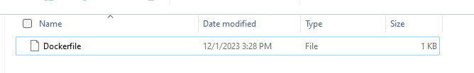

<h1 align="center"> Docker </h1>

# Content

1. [Chapter 1: Introducing to Docker](#chapter1)
    - [Chapter 1 - Part 1: What is Docker?](#chapter1part1)
2. [Chapter 2: Create a Container in Docker](#chapter2)
    - [Chapter 2 - Part 1: How to Create a Postgres Database in Docker?](#chapter2part1)

## <a name="chapter1"></a>Chapter 1: Introducing to Docker
  
#### <a name="chapter1part1"></a>Chapter 1 - Part 1: What is Docker?

Java Spring Framework (Spring Framework) is a popular, open source, enterprise-level framework for creating standalone, production-grade applications that run on the Java Virtual Machine (JVM).

## <a name="chapter1"></a>Chapter 2: Create a Container in Docker
  
#### <a name="chapter2part1"></a>Chapter 2 - Part 1: How to Create a Postgres Database in Docker?

To use docker, first you will need to install it.

In Windows, you could install [Docker Desktop](https://docs.docker.com/desktop/install/windows-install/).

**Create a Dockerfile**

First, to start a Postgres database in a docker container, we have to create a Dockerfile.

Create the Dockerfile in a directory

<br>

<div align="center"><br><sub>Dockerfile - (<a href='https://github.com/vitorstabile'>Work by Vitor Garcia</a>) </sub></div>

<br>

```
FROM postgres:15.1-alpine

LABEL author="Your Name"
LABEL description="Postgres Image for demo"
LABEL version="1.0"

COPY *.sql /docker-entrypoint-initdb.d/
```

Note that the line ```COPY``` below will copy all the sql files in our source folder, where we have our Dockerfile, and add them in the ```/docker-entrypoint-initdb.d/```

This folder in your Postgres container is where you can add additional initialization scripts (creating the directory if necessary).

**Create a docker-compose file**

Once you have created your docker file, now to run the Postgres container in a clean way, you can create a docker-compose.yml file.


```
services:
  postgres:
    build:
      context: .
      dockerfile: postgres.dockerfile
    image: "postgres-tutorials"
    container_name: ${PG_CONTAINER_NAME}
    environment:
      POSTGRES_DB: ${POSTGRES_DB}
      POSTGRES_USER: ${POSTGRES_USER}
      POSTGRES_PASSWORD: ${POSTGRES_PASSWORD}
      PGDATA: ${PGDATA}
    volumes:
       - dbtuto:/data/postgres-tuto
    ports:
      - "5432:5432"
    restart: unless-stopped
volumes:
    dbtuto:
      external: true
```

The values which are in this form ```${PG_CONTAINER_NAME}``` have been defined in an env file; to be managed easily. To do so, create a ```.env``` file in your source folder and add all the environment variables, like below.

```
PG_CONTAINER_NAME='postgres_tuto'
POSTGRES_USER='tuto'
POSTGRES_PASSWORD='admingres'
POSTGRES_DB='tutos'
PGDATA='/data/postgres-tuto'
```

***Create SQL scripts files***

Now that our compose file is ready, we can create our SQL scripts file that must be copied in ```/docker-entrypoint-initdb.d/```

File: ```01-init-db.sql```

```
-- CREATE TYPE
DROP TYPE IF EXISTS genre;
CREATE TYPE genre AS ENUM (
    'ADVENTURE',
    'HORROR',
    'COMEDY',
    'ACTION',
    'SPORTS'
);

-- CREATE TABLE
DROP TABLE IF EXISTS movies;
CREATE TABLE movies (
    id SERIAL PRIMARY KEY,
    title VARCHAR NOT NULL,
    release_year SMALLINT,
    genre genre,
    price NUMERIC(4, 2)
);
```

File: ```02-load-data.sql```

```
-- LOAD DATAS
INSERT INTO movies(id, title, release_year, genre, price)
VALUES
    (1, 'The Shaw shank Redemption', 1994, 'HORROR', 15.99),
    (2, 'Ant Man', 2019, 'ADVENTURE', 15.00),
    (3, 'Fallen', 1996, 'HORROR', 23.99),
    (4, 'The barbershop', 2006, 'COMEDY', 6.50),
    (5, 'The last dance', 2021, 'SPORTS', 55.99),
    (6, 'Peter Pan', 2004, 'ADVENTURE', 15.99),
    (7, 'Fast & Furious 7', 2018, 'ACTION', 36.00),
    (8, 'Harry Potter', 2000, 'ACTION', 26.50),
    (9, 'Jungle book', 2004, 'ADVENTURE', 25.00);
```

We start the names of those 2 files with ```01-*``` and ```02-*``` because these initialization files will be executed in sorted name. So we want the database to be created first, then load the data.

***Run our Postgres container***

Before running our Postgres container, we have specified in our docker-compose file that we will use an external volume.

```
# Here ↓
volumes:
    dbtuto:
      external: true
```

So in other to have an external volume we have to create it:

```
docker volume create dbtuto
```

Now we can launch our Postgres database with docker compose:

```
docker-compose up -d
```
